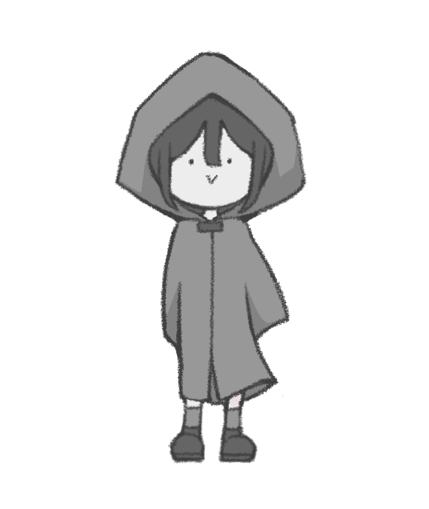

# Dye-Chromatic
Game Demo of Dye-Chromatic for course DH2650 at KTH.

    

## About 
Art must come from somewhere. Explore a world of colour where you challenge the immortals themselves to uncover new dyes for your palette. Mix and match your tools and conquer the realm with your supreme artistry.

## Demo

The demo showcases a vertical slice between the first and second boss. See a video demo on the [Dye-Chromatic Site](https://dye-chromatic.webflow.io/)

### Specifications
Made in Godot v.4.2.1

Add-ons:
- TexturePacker
- Kenney Particle Pack

(<a href="#readme-top">back to top</a>)

## Team
- Mert Demirsü 
- Simon William Grady Hocker
- Vilhelm Norström
- Julia Wang
- Yifan Wu
